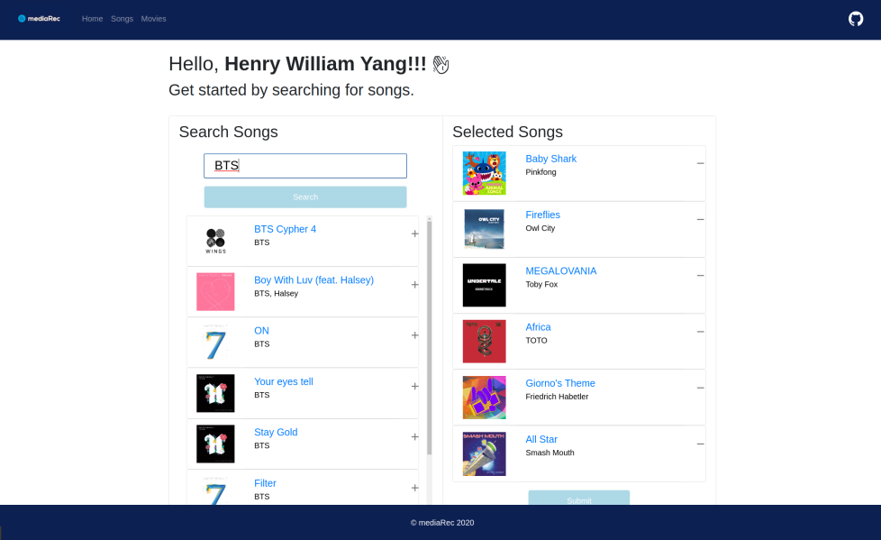
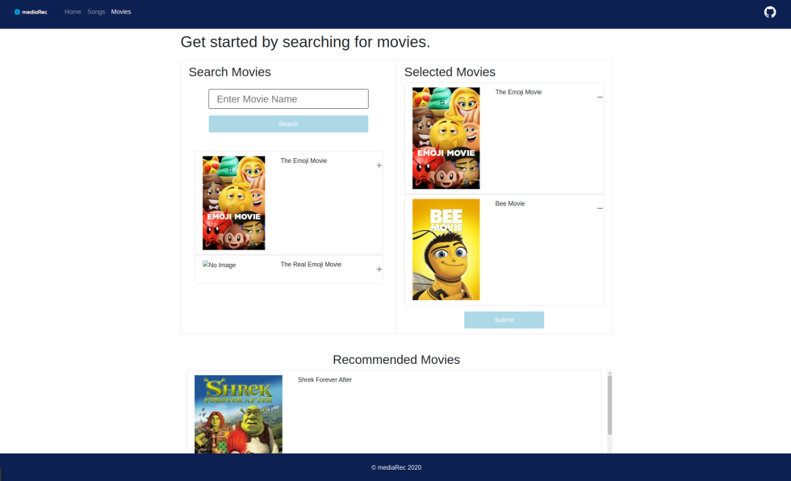

# mediaRec

Uses `React`, `Node.js`, and `Flask` to make a recommender for songs and movies. 

# Homepage

<!-- TABLE OF CONTENTS -->
## Table of Contents

* [About the Project](#about-the-project)
  * [Built With](#built-with)
* [Getting Started](#getting-started)
* [Contributing](#contributing)
* [License](#license)
* [Contact](#contact)
* [Acknowledgements](#acknowledgements)

<!-- ABOUT THE PROJECT -->
## About The Project

 

MediaRec is a songs and movies recommender that allows for an easy experience by just searching songs and/or movies and getting recommendations with the click of a button.

Core features:
* Connects with Spotify so you can search songs from Spotify or choose songs from your playlists.
* Recommends songs using a **custom built algorithm**, and allows you to save as a playlist to your Spotify account.
* Movie search is done with the TMDB API, so even the newest movies can be used.
* We DO NOT store any user data — log in is through Spotify only, and you can see the permissions when logging in. 

 

### Built With
* [React](https://reactjs.org/)
* [NodeJS](https://nodejs.org/en/)
* [Flask](https://flask.palletsprojects.com/en/1.1.x/)

<!-- GETTING STARTED -->
## Getting Started

MediaRec is deployed with Heroku at the link:
[MediaRec](https://media-rec.herokuapp.com/)  
https://media-rec.herokuapp.com/
 

Preview of songs page:

Preview of movies page:

<!-- CONTRIBUTING -->
## Contributing

Contributions are what make the open source community such an amazing place to be learn, inspire, and create. We welcome any contributions.   
Any contributions you make are **greatly appreciated**.

1. Fork the Project
2. Create your Feature Branch (`git checkout -b feature/AmazingFeature`)
3. Commit your Changes (`git commit -m 'Add some AmazingFeature'`)
4. Push to the Branch (`git push origin feature/AmazingFeature`)
5. Open a Pull Request

<!-- LICENSE -->
## License

Distributed under the MIT License. See `LICENSE` for more information.

<!-- CONTACT -->
## Contact

Kyle Lai - [@kyle-lai-01](https://github.com/kyle-lai-01) - kl655@cornell.edu  
Henry Li- [@henryli6](https://github.com/henryli6) - hl738@cornell.edu  
Tony Yang - [@tyang98](https://github.com/tyang98) - txy3@cornell.edu

Project Link: [https://github.com/tyang98/media-rec](https://github.com/tyang98/media-rec)

<!-- ACKNOWLEDGEMENTS -->
## Acknowledgements
* [create-react-app](https://reactjs.org/docs/create-a-new-react-app.html)
* [Spotify API](https://developer.spotify.com/documentation/web-api/)
* [The Movie DB API](https://developers.themoviedb.org/3/getting-started/introduction)
* [OAuth Bridge Template](https://github.com/mpj/oauth-bridge-template)
